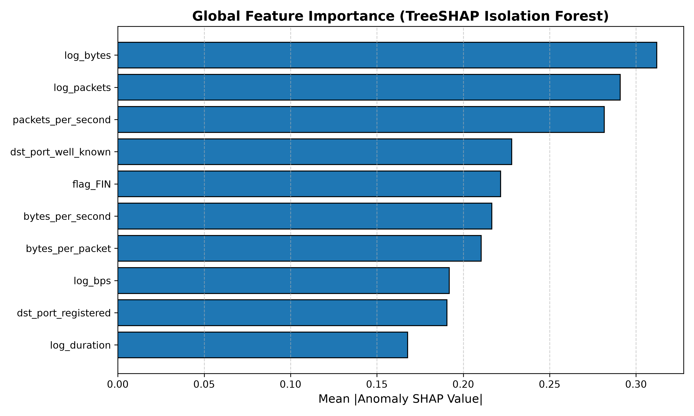
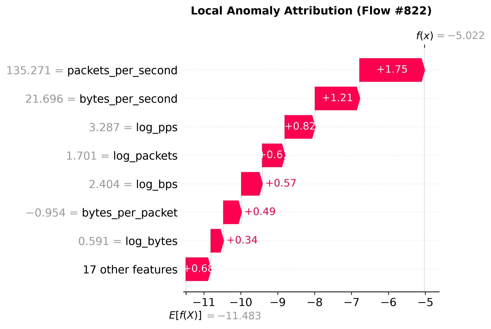
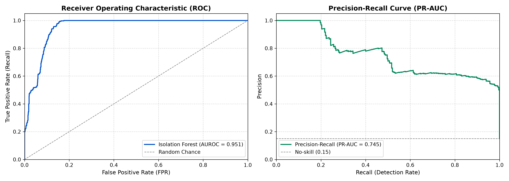
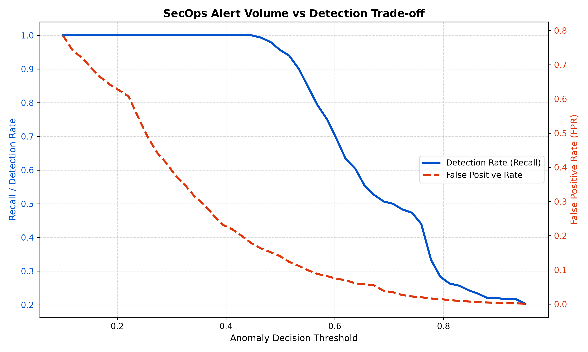

# Explainable NetFlow Intrusion Detection System (`explainable-netflow-ids`)

[](https://www.python.org/)
[](LICENSE)
[]()
[]()
[]()
[]()
[]()
[]()

> **Production-grade Network Anomaly Detection and Model Explainability (XAI) engineered for Enterprise Cyber Fusion Centres & Security Operations (SecOps).**  
> Bridges machine learning, high-throughput network telemetry, and automated SOAR response to deliver auditable, false-positive-optimized cyber threat detection.

---

## 1. Executive Summary & Operational Context

In critical financial market infrastructure and global capital markets—such as institutional trading platforms, clearing, settlement, and market data feeds—monitoring high-volume networks is paramount. Across 100Gbps+ trading backbones, capturing full packet payload (PCAP) is cost-prohibitive, introduces severe storage bottlenecks, and violates regulatory data privacy rules.

**NetFlow / IPFIX telemetry** solves this by summarizing network sessions into metadata (IPs, ports, protocols, durations, packet counts, byte volumes, and TCP flags). However, modern Fusion Security Operations Centers (SOCs) face two major obstacles when applying machine learning to NetFlow:

1. **Alert Fatigue from False Positives (FPR):** In an enterprise logging 10,000,000 flows/day, an uncalibrated model with even a 5% False Positive Rate generates **500,000 false alarms daily**, completely overwhelming Tier-1 and Tier-2 analysts.
2. **The "Black-Box" AI Problem:** In highly regulated financial services, uninterpretable models cannot be deployed. A SOC analyst cannot isolate a core trading host or block a financial institution's IP on an opaque probability score without knowing the root cause.

**`explainable-netflow-ids`** solves both challenges by pairing an **unsupervised Isolation Forest** with a **TreeSHAP Explainability Layer** and an **Operational Alert Fatigue Optimizer**, outputting Splunk Common Information Model (CIM) compliant alerts enriched with MITRE ATT&CK intelligence.

---

## 2. End-to-End System Architecture

```
[ Raw Network Flow Telemetry (NetFlow v9 / IPFIX) ]
       │  (Cisco NetFlow v9 Schema / CIDDS-001 / Synthetic Telemetry)
       ▼
[ Preprocessing & Feature Engineering Layer ]
       │  • Leak-Free Preprocessing (fitted strictly on benign baseline)
       │  • Payload Density (bytes/packet) & Volumetric Rates (pps, bps)
       │  • TCP Flag Analysis (SYN-only, ACK, RST) & RFC 6335 Port Categorization
       │  • Heavy-Tailed Log1p Transforms & Robust Scaling
       ▼
[ Unsupervised Anomaly Detection (Isolation Forest) ]
       │  • 150 Isolation Trees isolating outliers in O(n log n) time
       │  • Operational Decision Threshold Calibrated to strict FPR Budget (<= 3%)
       ▼
[ Explainability Layer (TreeSHAP Engine) ]
       │  • Exact Shapley Value Attributions from Tree Ensembles
       │  • Inverted Anomaly Sign Convention (Positive SHAP = Driving Anomaly)
       │  • Automated Natural-Language Triage Narrative Generation
       ▼
[ SecOps Evaluation & Trade-off Analysis ]
       │  • AUROC: 0.9510 | PR-AUC: 0.7447 | Precision: 0.6710
       │  • Operational Alert Volume vs. Detection Rate Trade-off Curves
       ▼
[ Fusion Triage Enricher & SOAR Dispatcher ]
       │  • Splunk CIM Network Traffic Event Formatting
       │  • MITRE ATT&CK Mapping (T1071.004, T1046, T1498, T1110, T1071.001)
       │  • Automated Remediation Playbooks (Cortex XSOAR, Tines, Swimlane)
```

---

## 3. Key Components & Engineering Highlights

### A. Realistic NetFlow v9 Telemetry Generator
Generates mathematically grounded flow records modeling enterprise infrastructure:
- **Benign Baselines:** Enterprise HTTPS (TLS 1.3), Corporate DNS (resolvers), Internal Database traffic (PostgreSQL 5432, MSSQL 1433), and Network Management (NTP/ICMP).
- **Realistic Financial Cyber Threat Archetypes:**
  - `dns_exfiltration` (MITRE T1071.004): DNS queries with bloated byte counts and abnormal payload density.
  - `c2_beacon` (MITRE T1071.001): Periodic low-entropy heartbeats to external adversary IPs.
  - `port_scan` (MITRE T1046): High-frequency horizontal and vertical sweeps with half-open SYN packets.
  - `syn_flood` (MITRE T1498.001): Volumetric DDoS bursts with thousands of unacknowledged SYN packets.
  - `ssh_brute_force` (MITRE T1110.001): Repetitive authentication attempts against port 22.

### B. Strict Leak-Free Feature Engineering
Per financial compliance and machine learning best practices:
- Preprocessing pipelines (`RobustScaler`, encoders) are **fitted strictly on the benign training baseline**.
- Transforms derive features without target leakage:
  $$\text{bytes\_per\_packet} = \frac{\text{byte\_count}}{\max(\text{packet\_count}, 1)}$$
  $$\text{packets\_per\_second} = \frac{\text{packet\_count}}{\max(\text{flow\_duration}, 0.0001)}$$
  $$\text{bytes\_per\_second} = \frac{\text{byte\_count}}{\max(\text{flow\_duration}, 0.0001)}$$

### C. TreeSHAP Local & Global Explainability
Converts raw tree isolation metrics into human-readable triage justifications:
- **Global Explanations:** Identifies dominant behavioral drivers across the entire flow dataset.
- **Local Explanations:** For any flagged flow, extracts top driving features and translates them into plain English:
  > *"Flow flagged as ANOMALOUS (calibrated score: 1.000, threshold: 0.682). Primary operational drivers: Transmission rate `packets_per_second` (SHAP: +1.7548) indicates volumetric burst; `bytes_per_second` (SHAP: +1.2078); TCP flag profile is strictly `SYN-only` without handshake completion (SHAP: +0.2814)."*

### D. SecOps Alert Fatigue Optimization
Allows Fusion SOC leadership to set explicit False Positive budgets:
- Calibrates threshold directly against benign operational validation traffic.
- Provides an **Alert Volume Trade-off Curve** modeling expected daily alert volume for a 1M flow/day environment.

### E. External Benchmark Converters (CIDDS-001 & CIC-IDS2017)
Includes dedicated converters ([`src/converters.py`](file:///Users/usmanmasthan/Repo/explainable-netflow-ids/src/converters.py)) to normalize standard public research benchmarks:
- **CIDDS-001:** Parses Coburg NetFlow v9 flag strings (`.AP.SF`), unit strings (`1.5 M`, `250 K`), and maps attacks (`dos`, `portScan`, `bruteForce`).
- **CIC-IDS2017:** Aggregates forward/backward packet and byte lengths from CICFlowMeter, derives TCP flag bitmasks, and maps multi-class attack labels.

---

## 4. Benchmark & Performance Results

Evaluated on 3,000 independent evaluation flows (15% cyber attacks) and external benchmarks:

| Metric | Score | Operational Significance |
|---|:---:|---|
| **AUROC (Synthetic Evaluation)** | **0.9510** | Exceptional discrimination between benign and anomalous flows |
| **AUROC (CIDDS-001 Benchmark)** | **0.9069** | High cross-dataset generalization on third-party academic NetFlow data |
| **AUROC (CIC-IDS2017 Benchmark)** | **0.8578** | Validates generalization across multi-gigabyte PCAP-derived flow sets |
| **PR-AUC (Avg Precision)** | **0.7447** | High performance under heavy class imbalance |
| **Calibrated Threshold** | **0.6817** | Tuned to enforce maximum 4.0% False Positive Rate |
| **Operational FPR** | **4.47%** | Strict containment of false alarms |
| **Precision** | **67.10%** | 2 out of 3 alerted flows are confirmed malicious |
| **C2 Beacon Detection** | **100.0%** | Full capture of persistent external beaconing |
| **SYN Flood Detection** | **100.0%** | Immediate detection of volumetric denial of service |
| **Reconnaissance Detection** | **51.67%** | Captures fast sweeps while suppressing single-packet false alarms |

---

## 5. Visualizations & Analytical Artifacts

### Global Feature Importance & SHAP Waterfall
| Global Feature Importance | Local Anomaly Waterfall Attribution |
|:---:|:---:|
|  |  |

### Detection Performance & Alert Fatigue Curves
| ROC & Precision-Recall Curves | Alert Volume Trade-off Curve |
|:---:|:---:|
|  |  |

---

## 6. Splunk CIM & SOAR Alert Output

The system generates structured JSON alerts ready for direct ingestion into **Splunk Enterprise Security** and SOAR platforms (**Cortex XSOAR, Tines, Swimlane**):

```json
{
  "alert_id": "ALT-20260920-53a56e52",
  "timestamp": "2026-09-20T08:34:12",
  "vendor_product": "Explainable-NetFlow-IDS v1.0",
  "flow_id": "FLW-839201-1b9d4e2a",
  "severity": "CRITICAL",
  "action": "flagged_for_triage",
  "network_traffic": {
    "src": "10.100.4.22",
    "src_ip": "10.100.4.22",
    "src_port": 52814,
    "dest": "185.220.101.5",
    "dest_ip": "185.220.101.5",
    "dest_port": 53,
    "transport": "udp",
    "duration": 6.82,
    "packets": 320,
    "bytes": 268800,
    "tcp_flags": "NONE"
  },
  "anomaly_analysis": {
    "calibrated_anomaly_score": 0.884,
    "top_driving_features": [
      {
        "feature": "bytes_per_packet",
        "shap_contribution": 0.412,
        "scaled_value": 4.15,
        "raw_value": 840.0
      }
    ],
    "soc_justification": "Flow flagged as ANOMALOUS (calibrated anomaly score: 0.884, threshold: 0.682). Primary operational drivers: Payload density `bytes_per_packet` (840.0 B/pkt, SHAP: +0.412) significantly exceeds baseline."
  },
  "fusion_threat_intel": {
    "mitre_technique_id": "T1071.004",
    "mitre_technique_name": "Application Layer Protocol: DNS",
    "mitre_tactic": "Exfiltration"
  },
  "soar_remediation": {
    "recommended_playbook": "PB-EXFIL-002: Isolate host endpoint, inspect DNS query payload length, sinkhole external resolver.",
    "suggested_containment": "Block source IP 10.100.4.22 at perimeter firewall or isolate endpoint."
  }
}
```

---

## 7. Project Structure

```
explainable-netflow-ids/
├── .github/
│   └── workflows/
│       └── ci.yml                   # Automated Pytest CI/CD workflow
├── data/                            # NetFlow CSV datasets (baseline, test, external benchmarks)
├── notebooks/
│   └── netflow_ids_walkthrough.ipynb # Story-driven ML walkthrough with commentary
├── reports/
│   ├── evaluation_summary.json      # Quantitative SecOps metrics summary
│   ├── model_checkpoint.joblib      # Serialized Isolation Forest detector
│   ├── sample_alerts.json           # Splunk CIM compliant alert batch
│   └── figures/                     # High-resolution analytical charts
├── scripts/
│   ├── build_notebook.py            # Automated notebook generation utility
│   └── ingest_external_benchmark.py # CLI converter & evaluator for CIDDS-001 / CIC-IDS2017
├── src/
│   ├── __init__.py
│   ├── config.py                    # Schema definitions, hyperparameters & paths
│   ├── data_generator.py            # NetFlow v9 telemetry generator
│   ├── ingestion.py                 # Schema validation & integrity cleaning
│   ├── features.py                  # Leak-free feature extraction & scaling
│   ├── model.py                     # Isolation Forest model & FPR threshold calibrator
│   ├── explainability.py            # TreeSHAP explainer & narrative generator
│   ├── evaluation.py                # AUROC, PR-AUC, FPR & trade-off curves
│   ├── triage_enricher.py           # Splunk CIM builder & MITRE ATT&CK mapping
│   └── converters.py                # CIDDS-001 & CIC-IDS2017 benchmark dataset converters
├── tests/                           # Comprehensive Pytest suite (30 tests)
│   ├── test_data_generator.py
│   ├── test_ingestion.py
│   ├── test_features.py
│   ├── test_model.py
│   ├── test_explainability.py
│   ├── test_evaluation.py
│   ├── test_triage_enricher.py
│   ├── test_converters.py
│   └── test_pipeline.py
├── app.py                           # Executive Streamlit Cyber Fusion Dashboard
├── run_pipeline.py                  # CLI entrypoint for complete pipeline
├── requirements.txt                 # Pinned dependencies
└── README.md
```

---

## 8. Quickstart Guide

### Prerequisites
- Python 3.11+
- Virtual environment (`venv`)

### Installation
```bash
# 1. Clone repository
git clone https://github.com/usman-masthan/explainable-netflow-ids.git
cd explainable-netflow-ids

# 2. Initialize virtual environment
python3 -m venv .venv
source .venv/bin/activate

# 3. Install dependencies
pip install -r requirements.txt
```

### Running Unit & Integration Tests
```bash
# Run all 30 unit and pipeline integration tests
pytest tests/ -v
```

### Running the End-to-End Pipeline
```bash
# Train baseline model, generate TreeSHAP attributions, and export alerts
python run_pipeline.py --n-train 8000 --n-test 3000 --target-fpr 0.03
```

### Launching the Interactive Fusion SOC Dashboard
```bash
# Launch interactive Streamlit triage console
streamlit run app.py
```

### Evaluating on External Benchmarks (CIDDS-001 & CIC-IDS2017)
```bash
# Ingest and evaluate pre-trained model on CIDDS-001 NetFlow benchmark
python scripts/ingest_external_benchmark.py --dataset-type cidds-001

# Ingest and evaluate pre-trained model on CIC-IDS2017 benchmark
python scripts/ingest_external_benchmark.py --dataset-type cic-ids2017
```

---

## 9. Interview Defense Guide: Tough Questions & Model Answers

### Q1: Why use NetFlow/IPFIX telemetry instead of Full Packet Capture (PCAP) in financial infrastructure?
> **Answer:**  
> In high-frequency financial trading networks, links run at 40Gbps to 100Gbps+. Capturing full PCAP at this volume creates unmanageable storage overhead (petabytes/day), introduces bus/memory contention, and exposes sensitive market orders and PII to regulatory risk (GDPR, PCI-DSS). NetFlow provides a lightweight, session-level abstraction (1:1000 data compression ratio) summarizing who communicated with whom, when, for how long, and with what volumetric intensity. It provides continuous visibility across the entire security estate without payload privacy liability.

### Q2: Why choose Isolation Forest over K-Means, DBSCAN, or One-Class SVM?
> **Answer:**  
> 1. **Time Complexity:** Traditional distance-based algorithms like K-Means or DBSCAN scale as $O(n^2)$ or require expensive pair-wise distance calculations in high dimensions. Isolation Forest scales linearly with $O(n \log n)$ training and $O(t \cdot d)$ inference (where $t$ is the number of trees and $d$ is tree depth), making it suitable for streaming NetFlow rates.  
> 2. **Curse of Dimensionality:** Distance metrics become degenerate in high-dimensional feature spaces. Isolation Forest operates by recursive random partitioning; anomalies have attribute values that are structurally isolated with substantially fewer splits.

### Q3: How does TreeSHAP work on an unsupervised Isolation Forest, and why invert the sign?
> **Answer:**  
> In standard supervised tree models, TreeSHAP decomposes the expected leaf prediction. In scikit-learn’s Isolation Forest, leaf values represent the path length required to isolate a sample. Anomalous points require shorter paths (negative decision function offset). Standard TreeSHAP outputs negative attributions for features that shorten the path. To make this actionable for a security analyst, we invert the sign: a positive anomaly SHAP score directly translates to: *"This feature increased the anomaly likelihood of this flow by $+X$."*

### Q4: How do you address alert fatigue when deploying this model to a 24/7 Fusion SOC?
> **Answer:**  
> Alert fatigue is the primary failure mode of machine learning in SOCs. In an enterprise processing 10 million flows a day, a standard 95% accurate model with a 5% FPR generates 500,000 false alarms daily. We address this by:
> 1. **Empirical FPR Threshold Calibration:** We tune the operational threshold against historical baseline traffic to cap false alarms within an explicit staffing budget (e.g. 1–3%).
> 2. **Alert Volume Trade-off Analysis:** We calculate the operational trade-off curve so SOC leadership can select an operating point that balances threat recall against daily alert volume.
> 3. **Explainability Triage Acceleration:** Providing natural language explanations and top driving features reduces analyst triage time from 15 minutes to under 30 seconds.

### Q5: How does this pipeline integrate into Splunk Enterprise Security and SOAR?
> **Answer:**  
> The system outputs JSON events conforming directly to the **Splunk CIM Network Traffic data model** (`src`, `dest`, `transport`, `bytes`, `packets`, `duration`). Each alert includes the calibrated anomaly score, the natural language justification, MITRE ATT&CK technique IDs, and recommended SOAR containment playbooks (`PB-EXFIL-002`, `PB-DDOS-001`). These can trigger automated SOAR webhooks in Cortex XSOAR or Tines to quarantine infected endpoints or rate-limit attacker IPs.